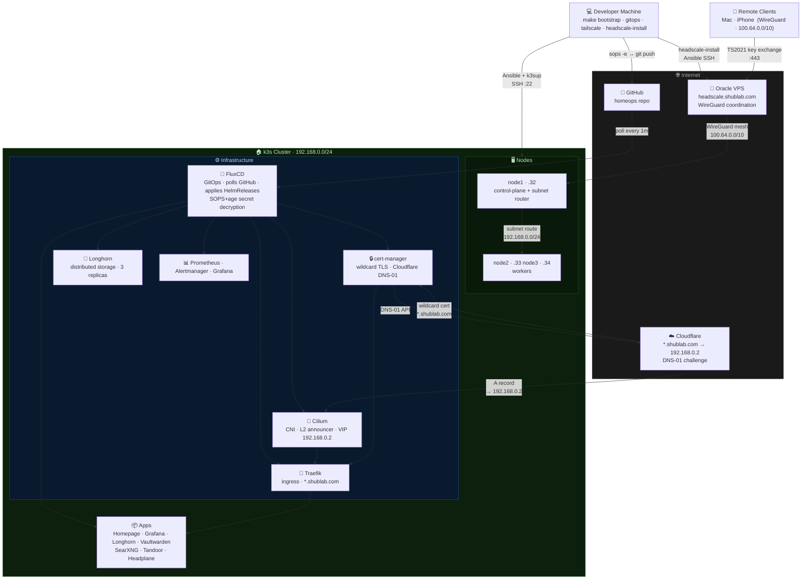

# homeops

> Enterprise-grade Kubernetes homelab deployed via GitOps

[](https://github.com/shubhamwagh/homeops/actions/workflows/ci.yml)

Bare-metal k3s homelab — GitOps with FluxCD, SOPS+age secrets, Cilium CNI+L2LB, Traefik ingress, cert-manager + Let's Encrypt, Longhorn storage, kube-prometheus-stack, and Headscale VPN.

---

## Architecture



### Traffic flows

| Flow | Path |
| --- | --- |
| LAN | `*.shublab.com` → Cloudflare DNS → Cilium VIP 192.168.0.2 → Traefik → service |
| Remote | Client → Headscale VPS (key exchange) → WireGuard P2P → node1 → subnet route → service |
| GitOps | git push → Flux polls GitHub → decrypt SOPS secrets → apply HelmReleases (~1 min) |
| TLS | cert-manager → Cloudflare DNS-01 → Let's Encrypt → wildcard cert → auto-renew |

---

## Prerequisites

- Ubuntu nodes reachable via SSH (see `infrastructure/metal/README.md`)
- Homebrew installed on control machine (macOS or Linux):

  ```bash
  # Linux only — install prerequisites first:
  sudo apt-get update && sudo apt-get install -y build-essential curl git procps

  /bin/bash -c "$(curl -fsSL https://raw.githubusercontent.com/Homebrew/install/HEAD/install.sh)"

  # Linux only — add brew to PATH, then install pipx via brew (uses Python 3.14):
  echo 'eval "$(/home/linuxbrew/.linuxbrew/bin/brew shellenv)"' >> ~/.bashrc && source ~/.bashrc
  brew install pipx
  ```

- Domain registered on **Cloudflare** (`shublab.com`)
- Oracle Free Tier VPS running headscale (see `vps/headscale/README.md`)
- Two env vars set:

```bash
export GITHUB_TOKEN=ghp_xxx        # GitHub PAT with repo scope
export CLOUDFLARE_TOKEN=cfut_xxx   # Cloudflare API token — Edit zone DNS
```

### Cloudflare DNS (one-time)

Three unproxied A records (orange cloud **OFF**):

| Type | Name | Content | Notes |
| --- | --- | --- | --- |
| A | `*` | `192.168.0.2` | wildcard → Cilium VIP |
| A | `shublab.com` | `192.168.0.2` | apex → Cilium VIP |
| A | `headscale` | `<vps-ip>` | overrides wildcard → Oracle VPS |

---

## Full Setup (fresh nodes → running cluster)

```bash
# 1. Install tools (once)
make tools

# 2. Configure cluster — enter node IPs, SSH key, cluster name
make configure

# 3. Deploy headscale on Oracle VPS
make headscale-install

# 4. Install k3s + Cilium CNI on bare metal
make bootstrap

# 5. Bootstrap GitOps — generates+encrypts all secrets, bootstraps Flux
GITHUB_TOKEN=xxx CLOUDFLARE_TOKEN=xxx make gitops

# 6. Wait for Flux to reconcile (~5 min), then verify
make flux-status

# 6a. Star key Grafana dashboards + set home dashboard
make grafana-setup

# 7. Register all nodes with headscale
make tailscale

# 8. Approve subnet route (auto-detects node1)
make headscale-approve-routes

# 9. Verify everything
make check
```

After step 5, back up `age.agekey` and delete `.secrets-plaintext`:

```bash
cp age.agekey ~/backups/age.agekey   # store securely — losing this = losing all secrets
rm .secrets-plaintext
```

After step 8, all nodes appear in Headplane at `headplane.shublab.com/admin/`.
Register Mac/iPhone manually — see [VPN section](#vpn--headscale-on-oracle-vps).

---

## VPN — Headscale on Oracle VPS

```bash
make headscale-install          # deploy to Oracle VPS
make tailscale                  # register all nodes
make headscale-approve-routes   # approve 192.168.0.0/24 subnet on node1
make headscale-teardown         # remove headscale from VPS
```

Register remote devices:

- **Mac/Linux:** `tailscale up --login-server=https://headscale.shublab.com --accept-routes --accept-dns=false`
- **iPhone:** Tailscale app → profile → Log in → Use a different server

See [`vps/headscale/README.md`](vps/headscale/README.md) for full details.

---

## Teardown + Rebuild

```bash
make teardown    # wipe k3s + tailscale from all nodes
make bootstrap   # reinstall k3s + cilium
GITHUB_TOKEN=xxx CLOUDFLARE_TOKEN=xxx make gitops
make tailscale   # reinstall tailscale + auto-register all nodes
```

`age.agekey` is preserved across teardown. Back it up and never lose it.

---

## Day-to-day

```bash
make flux-status      # show all Flux resources
make flux-sync        # force reconcile from git
make nodes            # kubectl get nodes -o wide
make tailscale        # re-provision tailscale on all nodes
make check            # full health check — nodes, flux, services, headscale
make grafana-setup    # star key dashboards + set home dashboard
```

---

## Stack

| Layer | Tool | Version |
| --- | --- | --- |
| Provisioning | Ansible + k3sup | - |
| CNI + L2 LB | Cilium | 1.17.3 |
| Ingress | Traefik | 32.1.0 |
| TLS | cert-manager + Let's Encrypt | v1.17.2 |
| TLS sync | Reflector | 9.* |
| Storage | Longhorn | 1.7.2 |
| Monitoring | kube-prometheus-stack | 79.* |
| Metrics | metrics-server | 3.12.2 |
| Security | CrowdSec | 0.12.* |
| Auto-restart | Reloader | 1.2.1 |
| GitOps | FluxCD | - |
| Secrets | SOPS + age | - |
| VPN coordination | Headscale | 0.28.0 |
| VPN client | Tailscale | - |
| Dependency updates | Renovate | 45.63.1 |

---

## Services

| Service | URL | Namespace |
| --- | --- | --- |
| Homepage | `home.shublab.com` | `homepage` |
| Grafana | `grafana.shublab.com` | `monitoring` |
| Longhorn | `longhorn.shublab.com` | `longhorn-system` |
| Traefik | `traefik.shublab.com` | `traefik` |
| Vaultwarden | `vault.shublab.com` | `vaultwarden` |
| SearXNG | `search.shublab.com` | `searxng` |
| Tandoor | `tandoor.shublab.com` | `tandoor` |
| TREK | `trek.shublab.com` | `trek` |
| Better Booking Bot | `booking-bot.shublab.com` | `better-booking-bot` |
| Car Health Check | `carhealth.shublab.com` | `car-health-check` |
| IT-Tools | `it-tools.shublab.com` | `it-tools` |
| Mailpit | `mailpit.shublab.com` | `mailpit` |
| Umami | `umami.shublab.com` | `umami` |
| Headplane | `headplane.shublab.com/admin/` | `headplane` |
| Headscale | `headscale.shublab.com` | Oracle VPS |

---

## Nodes

| Hostname | Role | LAN IP | Tailscale IP |
| --- | --- | --- | --- |
| homelab-hpg2-node1 | control-plane + subnet router | 192.168.0.32 | 100.64.0.x |
| homelab-hpg2-node2 | worker | 192.168.0.33 | 100.64.0.x |
| homelab-hpg2-node3 | worker | 192.168.0.34 | 100.64.0.x |

node1 advertises subnet route `192.168.0.0/24` — remote devices reach all services via VPN.

---

## Renovate

Renovate bot runs daily at 2am and opens PRs for outdated Helm chart versions.
Check the Dependency Dashboard issue on GitHub to trigger manual runs or approve updates.
