# homeops

Bare-metal k3s homelab — GitOps with FluxCD, SOPS+age secrets, Cilium CNI+L2LB, Traefik ingress, cert-manager + Let's Encrypt, Longhorn storage, kube-prometheus-stack, and Headscale VPN.

---

## 🏗️ Architecture

```mermaid
flowchart TB
    %% ── External ──────────────────────────────────────────────────────────
    subgraph ext["🌐 External Services"]
        GH["🐙 GitHub\nhomeops repo\nshubhamwagh/homeops"]
        CF["☁️ Cloudflare\n*.shublab.com → 192.168.0.2\nDNS-01 challenge API"]
        LECA["🔒 Let's Encrypt\nACME CA"]
        ORACLE["☁️ Oracle Free Tier VPS\nheadscale.shublab.com\n:443 TS2021  :41641 WG  :3478 STUN"]
    end

    %% ── Developer machine ─────────────────────────────────────────────────
    subgraph dev["💻 Developer Machine"]
        MK["⚙️ Makefile\nmake bootstrap · gitops\nmake tailscale · headscale-install"]
        AGEKEY["🗝️ age.agekey\nlocal only — never committed"]
        SOPSENC["🔐 SOPS + age\nencrypt *.sops.yaml\nvps/headscale secrets"]
        ANSIBLE["🤖 Ansible + k3sup\nbare-metal provisioning"]
    end

    %% ── k3s Cluster ───────────────────────────────────────────────────────
    subgraph cluster["🏠 k3s Cluster  ·  192.168.0.0/24"]

        subgraph nodes["🖥️ Bare Metal Nodes  (HP G2 Mini PCs)"]
            N1["node1  192.168.0.32\ncontrol-plane\nsubnet router"]
            N2["node2  192.168.0.33\nworker"]
            N3["node3  192.168.0.34\nworker"]
        end

        subgraph gitops["🔄 GitOps  ·  FluxCD"]
            FLUX["🔄 FluxCD\nGitRepository + Kustomizations\ninfrastructure → config → apps"]
            SOPSSEC["🔐 sops-age Secret\ndecrypts *.sops.yaml at deploy time"]
            RENOVATE["🤖 Renovate\ndaily 2am — Helm chart PRs"]
        end

        subgraph networking["🌐 Networking Layer"]
            CILIUM["🐝 Cilium CNI\nL2 announcer\nVIP: 192.168.0.2/28"]
            TRAEFIK["🔀 Traefik  32.1.0\ningress controller\nLB IP: 192.168.0.2\ndashboard: traefik.shublab.com"]
            CERTMGR["🔒 cert-manager  v1.17.2\nwildcard *.shublab.com\nCloudflare DNS-01"]
            REFLECTOR["🪞 Reflector\nsyncs TLS secret\nacross namespaces"]
            CROWDSEC["🛡️ CrowdSec  0.12\nIDS/IPS Traefik middleware"]
            RELOADER["♻️ Reloader  1.2.1\nauto-restart on\nConfigMap/Secret change"]
        end

        subgraph storage["💾 Storage"]
            LONGHORN["💾 Longhorn  1.7.2\ndistributed block storage\n3-replica across nodes\nlonghorn.shublab.com"]
        end

        subgraph observability["📊 Observability"]
            PROM["📊 kube-prometheus-stack  79.*\nPrometheus + Alertmanager"]
            GRAFANA["📈 Grafana\ngrafana.shublab.com"]
            METRICS["📏 metrics-server  3.12.2\nHPA + kubectl top"]
        end

        subgraph apps["📦 Applications"]
            HOMEPAGE["🏠 Homepage\nhome.shublab.com"]
            VAULTWARDEN["🔐 Vaultwarden\nvault.shublab.com"]
            SEARXNG["🔍 SearXNG\nsearch.shublab.com"]
            TANDOOR["🍳 Tandoor\ntandoor.shublab.com"]
            HEADPLANE["🎛️ Headplane\nheadplane.shublab.com/admin"]
        end
    end

    %% ── Remote clients ────────────────────────────────────────────────────
    subgraph remote["📱 Remote Clients  ·  WireGuard  ·  100.64.0.0/10"]
        MAC["💻 Mac\ntailscale client"]
        IPHONE["📱 iPhone\ntailscale client"]
    end

    %% ── Edges: provisioning ───────────────────────────────────────────────
    MK --> AGEKEY
    MK --> ANSIBLE
    AGEKEY --> SOPSENC
    ANSIBLE -- "SSH :22\nk3sup install" --> N1
    ANSIBLE -- "SSH :22\nk3sup join" --> N2 & N3
    SOPSENC -- "sops -e\ncommit to git" --> GH

    %% ── Edges: GitOps flow ────────────────────────────────────────────────
    GH -- "poll every 1m" --> FLUX
    FLUX --> SOPSSEC
    SOPSSEC -- "decrypt secrets\nat apply time" --> FLUX
    RENOVATE -- "opens PRs" --> GH
    FLUX -- "HelmRelease\nKustomization" --> CILIUM & TRAEFIK & CERTMGR & LONGHORN & PROM & apps & CROWDSEC & RELOADER & REFLECTOR & RENOVATE

    %% ── Edges: TLS ────────────────────────────────────────────────────────
    CERTMGR -- "DNS-01 challenge\nAPI token" --> CF
    CF -- "challenge response" --> LECA
    LECA -- "wildcard cert\n*.shublab.com" --> CERTMGR
    CERTMGR --> REFLECTOR
    REFLECTOR -- "sync secret\nto all namespaces" --> TRAEFIK

    %% ── Edges: traffic ────────────────────────────────────────────────────
    CF -- "*.shublab.com\n→ 192.168.0.2" --> CILIUM
    CILIUM -- "L2 announce\nVIP" --> TRAEFIK
    TRAEFIK --> CROWDSEC
    CROWDSEC --> HOMEPAGE & VAULTWARDEN & SEARXNG & TANDOOR & HEADPLANE & GRAFANA & LONGHORN
    PROM --> GRAFANA

    %% ── Edges: VPN ────────────────────────────────────────────────────────
    MK -- "make headscale-install\nAnsible over SSH" --> ORACLE
    MAC -- "TS2021 WebSocket\nkey exchange" --> ORACLE
    IPHONE -- "TS2021 WebSocket\nkey exchange" --> ORACLE
    ORACLE -- "WireGuard mesh\n100.64.0.0/10" --> N1
    N1 -- "subnet route\n192.168.0.0/24" --> N2 & N3
    MAC & IPHONE -- "WireGuard P2P\nudp :41641" --> N1

    %% ── Styles ────────────────────────────────────────────────────────────
    style ext fill:#1a1a1a,stroke:#555555,color:#aaaaaa
    style dev fill:#2e1a2e,stroke:#aa44aa,color:#f0c0f0
    style cluster fill:#0d1f0d,stroke:#2a6a2a,color:#c0f0c0
    style nodes fill:#0a1a0a,stroke:#1a5a1a,color:#c0f0c0
    style gitops fill:#1a1a2e,stroke:#4444aa,color:#c0c0ff
    style networking fill:#0a1a2e,stroke:#1a4a8a,color:#c0d8ff
    style storage fill:#1a0a0a,stroke:#8a2a2a,color:#ffc0c0
    style observability fill:#1a1a0a,stroke:#8a8a00,color:#ffffc0
    style apps fill:#2a1a3a,stroke:#7744aa,color:#f0d0ff
    style remote fill:#3a2a1a,stroke:#cc8844,color:#ffe0c0
```



### 🚦 Traffic flows

| Flow | Path | Notes |
| --- | --- | --- |
| **LAN** | `*.shublab.com` → Cloudflare DNS → Cilium VIP 192.168.0.2 → Traefik → service | Direct, no VPN needed on LAN |
| **Remote** | Client → Headscale VPS (key exchange) → WireGuard P2P → node1 → subnet route → service | VPS handles only control plane |
| **GitOps** | git push → Flux polls GitHub → decrypt SOPS secrets → apply HelmReleases | ~1 min reconcile |
| **TLS** | cert-manager → Cloudflare DNS-01 → Let's Encrypt → wildcard cert → Reflector syncs | Auto-renew 30 days before expiry |

---

## Prerequisites

- Ubuntu nodes reachable via SSH (see `infrastructure/metal/README.md`)
- Homebrew installed on control machine
- Domain registered on **Cloudflare** (`shublab.com`)
- Oracle Free Tier VPS running headscale (see `vps/headscale/README.md`)
- Two env vars set:

```bash
export GITHUB_TOKEN=ghp_xxx        # GitHub PAT with repo scope
export CLOUDFLARE_TOKEN=cfut_xxx   # Cloudflare API token — Edit zone DNS
```

### Cloudflare DNS (one-time)

Three unproxied A records (orange cloud **OFF**):

| Type | Name | Content | Notes |
| --- | --- | --- | --- |
| A | `*` | `192.168.0.2` | wildcard → Cilium VIP |
| A | `shublab.com` | `192.168.0.2` | apex → Cilium VIP |
| A | `headscale` | `141.147.112.251` | overrides wildcard → Oracle VPS |

---

## 🚀 Full Setup (fresh nodes → running cluster)

```bash
# 1. Install tools (once)
make tools

# 2. Configure cluster — enter node IPs, SSH key, cluster name
make configure

# 3. Install k3s + Cilium CNI
make bootstrap

# 4. Bootstrap GitOps — generates+encrypts all secrets, bootstraps Flux
GITHUB_TOKEN=xxx CLOUDFLARE_TOKEN=xxx make gitops

# 5. Install Tailscale on all nodes + register with headscale
make tailscale
```

After step 4, Flux reconciles the repo and deploys everything automatically.
Back up `age.agekey` securely — without it encrypted secrets cannot be decrypted.

After step 5, all nodes appear in Headplane at `headplane.shublab.com/admin/`.

---

## 🔧 VPN — Headscale on Oracle VPS

```bash
# Deploy headscale to a fresh Ubuntu VPS
make headscale-install

# Register remote devices
#   Mac/Linux: tailscale up --login-server=https://headscale.shublab.com --accept-routes
#   iPhone:    Tailscale app → account → use custom login server
```

See [`vps/headscale/README.md`](vps/headscale/README.md) for full details.

---

## 💣 Teardown + Rebuild

```bash
make teardown    # wipe k3s + tailscale from all nodes
make bootstrap   # reinstall k3s + cilium
GITHUB_TOKEN=xxx CLOUDFLARE_TOKEN=xxx make gitops
make tailscale   # reinstall tailscale + auto-register all nodes
```

`age.agekey` is preserved across teardown. Back it up and never lose it.

---

## 🛠️ Day-to-day

```bash
make flux-status      # show all Flux resources
make flux-sync        # force reconcile from git
make nodes            # kubectl get nodes -o wide
make tailscale        # re-provision tailscale on all nodes
```

---

## 📦 Stack

| Layer | Tool | Version |
| --- | --- | --- |
| Provisioning | Ansible + k3sup | - |
| CNI + L2 LB | Cilium | 1.17.3 |
| Ingress | Traefik | 32.1.0 |
| TLS | cert-manager + Let's Encrypt | v1.17.2 |
| TLS sync | Reflector | 9.* |
| Storage | Longhorn | 1.7.2 |
| Monitoring | kube-prometheus-stack | 79.* |
| Metrics | metrics-server | 3.12.2 |
| Security | CrowdSec | 0.12.* |
| Auto-restart | Reloader | 1.2.1 |
| GitOps | FluxCD | - |
| Secrets | SOPS + age | - |
| VPN coordination | Headscale | 0.28.0 |
| VPN client | Tailscale | - |
| Dependency updates | Renovate | 45.63.1 |

---

## 🌐 Services

| Service | URL | Namespace |
| --- | --- | --- |
| 🏠 Homepage | `home.shublab.com` | `homepage` |
| 📊 Grafana | `grafana.shublab.com` | `monitoring` |
| 💾 Longhorn | `longhorn.shublab.com` | `longhorn-system` |
| 🔀 Traefik | `traefik.shublab.com` | `traefik` |
| 🔐 Vaultwarden | `vault.shublab.com` | `vaultwarden` |
| 🔍 SearXNG | `search.shublab.com` | `searxng` |
| 🍳 Tandoor | `tandoor.shublab.com` | `tandoor` |
| 🎛️ Headplane | `headplane.shublab.com/admin/` | `headplane` |
| 🎯 Headscale | `headscale.shublab.com` | Oracle VPS |

---

## 🖥️ Nodes

| Hostname | Role | LAN IP | Tailscale IP |
| --- | --- | --- | --- |
| homelab-hpg2-node1 | control-plane + subnet router | 192.168.0.32 | 100.64.0.x |
| homelab-hpg2-node2 | worker | 192.168.0.33 | 100.64.0.x |
| homelab-hpg2-node3 | worker | 192.168.0.34 | 100.64.0.x |

node1 advertises subnet route `192.168.0.0/24` — remote devices reach all services via VPN.

---

## 🤖 Renovate

Renovate bot runs daily at 2am and opens PRs for outdated Helm chart versions.
Check the Dependency Dashboard issue on GitHub to trigger manual runs or approve updates.
