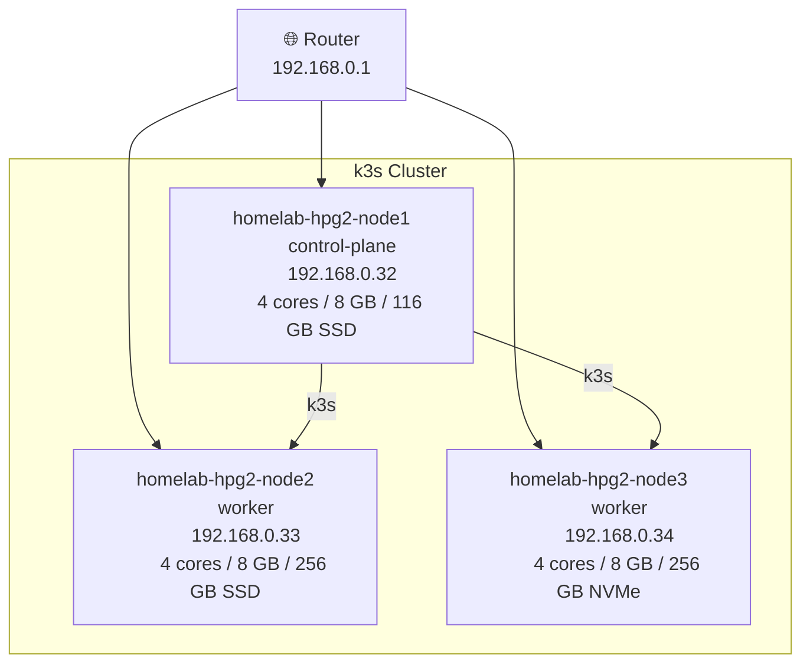

## Cluster Topology



# Metal

Bare-metal node setup for the homeops k3s cluster.

## Hardware

All nodes are **HP EliteDesk 800 G2 DM 35W** mini PCs.

| Hostname | Role | IP | CPU | RAM | Disk |
|---|---|---|---|---|---|
| homelab-hpg2-node1 | control-plane | 192.168.0.32 | 4 cores | 8 GB | 116 GB SSD |
| homelab-hpg2-node2 | worker | 192.168.0.33 | 4 cores | 8 GB | 256 GB SSD |
| homelab-hpg2-node3 | worker | 192.168.0.34 | 4 cores | 8 GB | 256 GB NVMe |

## OS

Ubuntu 24.04 LTS - https://ubuntu.com/download/server

Flash to USB with [Balena Etcher](https://etcher.balena.io), boot each node, and run through the installer.

## Static IPs

Repeat for each node.

**1. Identify network interface**
```bash
ip addr
```
Look for the primary interface (e.g., `eno1`, `enp1s0`).

**2. Identify default gateway**
```bash
ip route
```

**3. Edit netplan config**
```bash
sudo vi /etc/netplan/50-cloud-init.yaml
```

```yaml
network:
  version: 2
  ethernets:
    eno1:          # replace with your interface name
      dhcp4: no
      addresses:
        - 192.168.0.32/24   # set per node: .32, .33, .34
      routes:
        - to: default
          via: 192.168.0.1
      nameservers:
        addresses:
          - 8.8.8.8
          - 8.8.4.4
```

**4. Apply and verify**
```bash
sudo netplan apply
ip a
ping 8.8.8.8
```

## SSH Config (control machine)

Add to `~/.ssh/config` on your control machine to SSH using hostnames:

```
# HomeLab
Host homelab-hpg2-node1
    HostName 192.168.0.32

Host homelab-hpg2-node2
    HostName 192.168.0.33

Host homelab-hpg2-node3
    HostName 192.168.0.34
```

Then copy your SSH key to each node:
```bash
ssh-copy-id homelab-hpg2-node1
ssh-copy-id homelab-hpg2-node2
ssh-copy-id homelab-hpg2-node3
```

## One-time Node Setup

Run on **each node** after Ubuntu install:

```bash
# 1. Essential packages for Longhorn storage
sudo apt update && sudo apt install -y \
  open-iscsi \
  nfs-common \
  cifs-utils

# 2. Enable iSCSI (required for Longhorn)
sudo systemctl enable --now iscsid

# 3. Kernel modules for Cilium
sudo modprobe iptable_raw xt_socket
echo -e "xt_socket\niptable_raw" | sudo tee /etc/modules-load.d/cilium.conf

# 4. Disable firewall (k3s + Cilium manage their own rules)
sudo ufw disable

# 5. Passwordless sudo - required by k3sup to install k3s
echo "$USER ALL=(ALL) NOPASSWD:ALL" | sudo tee /etc/sudoers.d/$USER
```

> k3s is installed via [k3sup](https://github.com/alexellis/k3sup) - a lightweight utility that bootstraps k3s over SSH.

## Verify Before Running make bootstrap

```bash
ssh homelab-hpg2-node1 hostname
ssh homelab-hpg2-node2 hostname
ssh homelab-hpg2-node3 hostname

ssh homelab-hpg2-node1 systemctl is-active iscsid
ssh homelab-hpg2-node2 systemctl is-active iscsid
ssh homelab-hpg2-node3 systemctl is-active iscsid
```

## Then

```bash
make configure   # enter node IPs, SSH key, cluster name
make bootstrap   # k3s install + cilium
make gitops      # secrets + flux bootstrap
```
