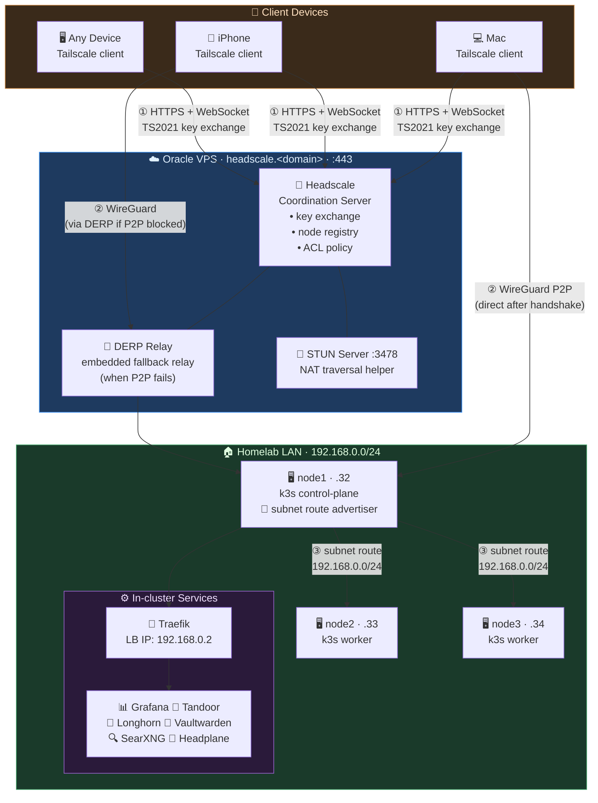

# Headscale VPS Setup

Headscale coordination server on a public VPS — enables WireGuard VPN mesh
accessible from any network (mobile, internet, coffee shop).

## Why a VPS?

Headscale uses **TS2021** protocol (WebSocket upgrade). Cloudflare proxy strips
WebSocket `Upgrade` headers even with "WebSockets" toggled on, making Cloudflare
Tunnel fundamentally incompatible. A VPS with a direct public IP is required.

## Architecture



### Traffic flows

| Step | Path | Protocol |
|---|---|---|
| ① Control plane | Device → VPS → device receives WG config | HTTPS / WebSocket |
| ② Data plane | Device ↔ node1 directly (P2P) | WireGuard UDP |
| ② fallback | Device → DERP → node1 (when P2P blocked by NAT) | WireGuard over TCP |
| ③ Subnet | node1 routes → entire 192.168.0.0/24 LAN | WireGuard |

> **Key insight:** The VPS only handles key exchange. Actual data flows peer-to-peer between devices — VPS bandwidth is minimal.

---

## Oracle Free Tier Instance

| Setting | Value |
|---|---|
| Shape | VM.Standard.E2.1.Micro (Always Free) |
| OS | Ubuntu 24.04 |
| SSH user | `ubuntu` |

### Required firewall rules (Oracle Security List)

| Protocol | Port | Purpose |
|---|---|---|
| TCP | 22 | SSH admin access |
| TCP | 80 | Let's Encrypt HTTP-01 challenge |
| TCP | 443 | Headscale HTTPS + TS2021 WebSocket |
| UDP | 41641 | WireGuard direct connections |
| UDP | 3478 | STUN — NAT traversal |

> OS-level iptables rules are managed automatically by the Ansible playbook.

---

## Setup (fresh VPS)

```bash
cd vps/headscale

# 1. Copy and fill in your values
cp inventory.yml.example inventory.yml     # edit: VPS IP, SSH user
cp vars.yml.example vars.yml               # edit: domain, VPS IP, region

# 2. Run install
ansible-playbook playbooks/install.yml -e @vars.yml
```

The playbook:
- Opens firewall ports (iptables + saves rules)
- Downloads and installs headscale deb
- Writes config from Jinja2 template
- Starts headscale + auto-issues Let's Encrypt TLS cert
- Waits for `/health` to pass
- Creates default user `shubham`

---

## Variables (vars.yml)

| Variable | Description | Example |
|---|---|---|
| `headscale_version` | Headscale release | `0.28.0` |
| `headscale_domain` | Public FQDN | `headscale.yourdomain.com` |
| `headscale_vps_ip` | VPS public IP (for DERP) | `1.2.3.4` |
| `headscale_acme_email` | Let's Encrypt email | `you@example.com` |
| `headscale_dns_base_domain` | MagicDNS base (must differ from headscale_domain) | `vpn.yourdomain.com` |
| `headscale_derp_region_code` | Short DERP region code | `oracle-london` |
| `headscale_derp_region_name` | Display name in Tailscale UI | `Oracle London` |

---

## Register devices

### k3s nodes (automated)

```bash
# From homeops root — installs tailscale + auto-registers all nodes
make tailscale
```

### Mac / Linux

```bash
tailscale up --login-server=https://headscale.<domain> --accept-routes
# Visit the URL shown, then on the VPS:
ssh ubuntu@<vps-ip> "sudo headscale nodes register --user shubham --key <key>"
# Fix hostname if needed (Mac registers as "invalid-xxx"):
ssh ubuntu@<vps-ip> "sudo headscale nodes rename --identifier <id> my-macbook"
```

### iPhone / Android

1. Install Tailscale app
2. Tap profile → **Log in** → **Use a different server**
3. Enter `https://headscale.<domain>`
4. Register the shown key on the VPS

---

## Day-to-day operations

```bash
# SSH to VPS
ssh ubuntu@<vps-ip>

# List registered nodes
sudo headscale nodes list

# Generate pre-auth key (used by make tailscale)
sudo headscale preauthkeys create --user shubham --reusable --expiration 2h

# Approve subnet route for node1
sudo headscale nodes approve-routes --identifier <id> --routes 192.168.0.0/24

# Check headscale logs
sudo journalctl -u headscale -f
```

---

## Teardown

```bash
cd vps/headscale
ansible-playbook playbooks/teardown.yml -e @vars.yml
```

Stops and removes headscale + all data. Does **not** terminate the VPS instance.
All devices will disconnect automatically. Re-run install to restore.

---

## Headplane UI

Headplane runs in-cluster at `headplane.<domain>/admin/` and manages this VPS.
API key stored in `infrastructure/base/networking/headplane/secret.sops.yaml`.

```bash
# Generate new API key (valid 1 year)
ssh ubuntu@<vps-ip> "sudo headscale apikeys create --expiration 8760h"
```

Update the SOPS secret and push — Flux applies it automatically.
