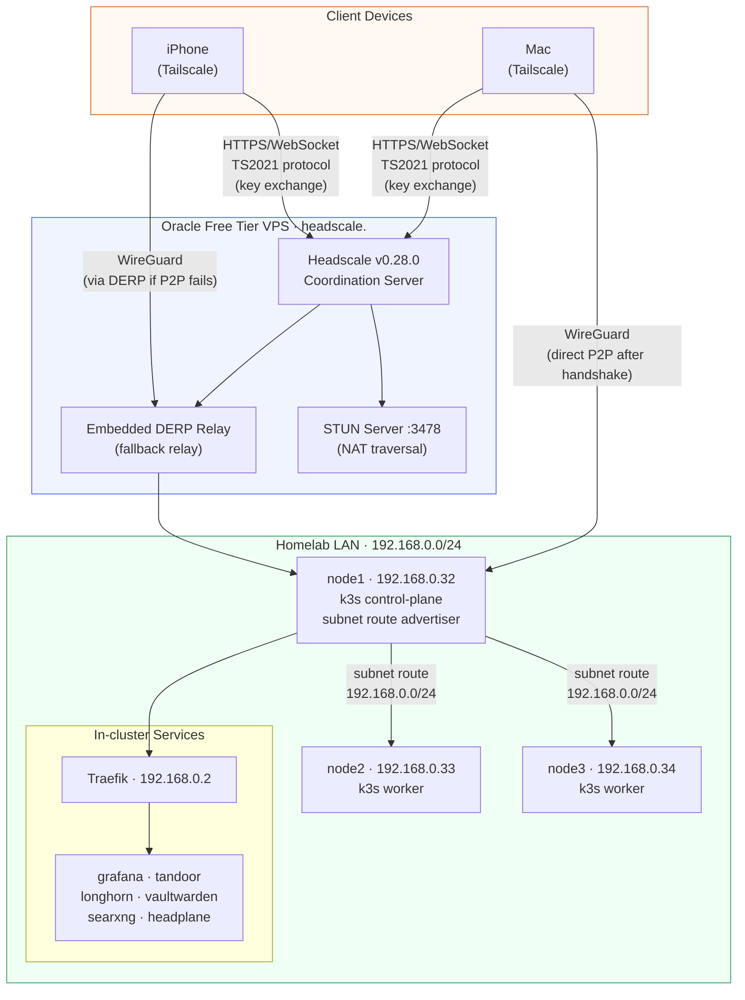

# Headscale VPS Setup

Headscale coordination server running on Oracle Free Tier VPS (Ubuntu, x86_64).
Provides internet/mobile access to the homelab via WireGuard VPN mesh.

## Why a VPS?

Headscale uses the TS2021 protocol (WebSocket upgrade). Cloudflare proxy strips
WebSocket headers, making Cloudflare tunnel incompatible. A VPS with a direct
public IP is required for reliable mobile + internet connectivity.

## Architecture



**Control plane flow:** Devices register with headscale VPS via HTTPS/WebSocket (TS2021). VPS stores node keys and issues WireGuard configuration.

**Data plane flow:** After handshake, WireGuard traffic is peer-to-peer (bypasses VPS). DERP relay used only when direct connection fails (NAT/firewall).

**Subnet routing:** node1 advertises `192.168.0.0/24` — remote devices reach all homelab services without VPN on every node.

## Oracle Free Tier Instance

| Setting | Value |
|---|---|
| Shape | VM.Standard.E2.1.Micro (Always Free) |
| OS | Ubuntu 24.04 |
| Region | uk-london-1 |
| Public IP | <vps-ip> (ephemeral) |
| SSH user | ubuntu |

### Required firewall rules (Oracle Security List)

| Protocol | Port | Purpose |
|---|---|---|
| TCP | 22 | SSH |
| TCP | 80 | Let's Encrypt HTTP-01 ACME challenge |
| TCP | 443 | Headscale HTTPS + TS2021 WebSocket |
| UDP | 41641 | WireGuard direct connections |
| UDP | 3478 | STUN (NAT traversal) |

OS-level iptables rules are managed by the Ansible playbook.

## Setup (fresh VPS)

```bash
cd vps/headscale

# 1. Edit inventory.yml with your VPS IP and SSH user
# 2. Edit group_vars/all.yml with your domain and VPS IP

# 3. Run install playbook
ansible-playbook playbooks/install.yml
```

The playbook will:
- Open firewall ports (iptables)
- Install headscale
- Write config from template
- Start headscale (Let's Encrypt cert auto-issued on first request)
- Create default user `shubham`

## Variables (group_vars/all.yml)

| Variable | Description | Default |
|---|---|---|
| `headscale_version` | Headscale release version | `0.28.0` |
| `headscale_domain` | Public domain for headscale | `headscale.<domain>` |
| `headscale_vps_ip` | VPS public IP (for DERP config) | `<vps-ip>` |
| `headscale_acme_email` | Email for Let's Encrypt notifications | `""` |
| `headscale_dns_base_domain` | MagicDNS base domain | `vpn.<domain>` |

## Register devices

### Nodes (automated via make tailscale)

```bash
# From homeops root — installs tailscale on all k3s nodes + auto-registers
make tailscale
```

### Mac / Linux

```bash
tailscale up --login-server=https://headscale.<domain> --accept-routes
# Visit the URL shown, then register the key:
ssh ubuntu@<vps-ip> "sudo headscale nodes register --user shubham --key <key>"
```

### iPhone / Android

1. Install Tailscale app
2. Tap account → "Use a different server"
3. Enter `https://headscale.<domain>`
4. Register the shown key on the VPS

## Day-to-day operations

```bash
# SSH to VPS
ssh ubuntu@<vps-ip>

# List nodes
sudo headscale nodes list

# Generate pre-auth key (for make tailscale)
sudo headscale preauthkeys create --user shubham --reusable --expiration 2h

# Approve subnet route for node1
sudo headscale nodes approve-routes --identifier <id> --routes 192.168.0.0/24

# Rename a node (Mac registers as "invalid-xxx" due to hostname restrictions)
sudo headscale nodes rename --identifier <id> shubhams-macbook-pro
```

## Teardown

```bash
cd vps/headscale
ansible-playbook playbooks/teardown.yml
```

This stops and removes headscale + all data from the VPS. Does not delete nodes
from headscale (they'll disconnect automatically). Does not terminate the VPS instance.

## Headplane UI

Headplane runs in-cluster at `headplane.<domain>/admin/` and connects to this VPS.
API key is stored in `infrastructure/base/networking/headplane/secret.sops.yaml`.

To generate a new API key:
```bash
ssh ubuntu@<vps-ip> "sudo headscale apikeys create --expiration 8760h"
```
Then update the SOPS secret and push — Flux will apply it automatically.
