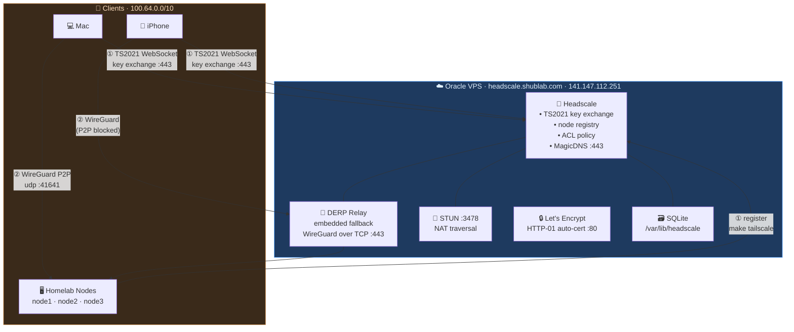

# Headscale VPS

Headscale coordination server on a public Oracle VPS — WireGuard mesh accessible from any network.
Secrets encrypted with SOPS+age and committed to git. Single `make` command to install or teardown.

---

## Architecture



### Traffic flows

| Step | Path | Protocol | Port |
| --- | --- | --- | --- |
| ① Control plane | Device → VPS: key exchange, WG config issued | HTTPS / WebSocket | 443 |
| ② Data plane (P2P) | Device ↔ nodes directly after handshake | WireGuard UDP | 41641 |
| ② Data plane (relay) | Device → DERP → nodes when NAT blocks P2P | WireGuard over TCP | 443 |

> **Key insight:** VPS only handles key exchange. Actual data flows peer-to-peer — VPS bandwidth is minimal.

---

## Secrets & Config

All sensitive values are SOPS+age encrypted and committed to git. **No `.example` files to copy.**

```text
vps/headscale/
├── inventory.yml          # SOPS encrypted  — VPS IP, SSH user
├── group_vars/all.yml     # SOPS encrypted  — headscale domain, region, version
├── ansible.cfg            # not sensitive   — SSH defaults
├── playbooks/
│   ├── install.yml        # not sensitive   — ansible tasks
│   └── teardown.yml       # not sensitive   — ansible tasks
└── templates/
    └── config.yaml.j2     # not sensitive   — headscale config template
```

### Edit encrypted files

```bash
# From homeops root — sops opens in $EDITOR, re-encrypts on save
sops vps/headscale/inventory.yml
sops vps/headscale/group_vars/all.yml

# Decrypt to stdout (inspect)
sops -d vps/headscale/inventory.yml
sops -d vps/headscale/group_vars/all.yml
```

---

## Oracle Free Tier Instance

| Setting | Value |
| --- | --- |
| Shape | VM.Standard.E2.1.Micro (Always Free) |
| OS | Ubuntu 24.04 |
| SSH user | `ubuntu` |
| Architecture | x86_64 or aarch64 (playbook auto-selects deb) |

### Required firewall rules (Oracle Security List)

| Protocol | Port | Purpose |
| --- | --- | --- |
| TCP | 22 | SSH — Ansible provisioning |
| TCP | 80 | Let's Encrypt HTTP-01 challenge |
| TCP | 443 | Headscale HTTPS + TS2021 WebSocket |
| UDP | 41641 | WireGuard direct connections |
| UDP | 3478 | STUN — NAT traversal |

> OS-level iptables rules are managed automatically by the Ansible playbook.

---

## First-time Setup

### Prerequisites

- Oracle Free Tier VPS running Ubuntu 24.04
- DNS A record: `headscale.shublab.com` → VPS public IP (unproxied, not Cloudflare proxied)
- Ports 80, 443, 41641/udp, 3478/udp open in Oracle Security List
- `age.agekey` present in homeops root (run `make ensure-age-key` if not)

### 1. Update inventory & vars

```bash
# From homeops root
sops vps/headscale/inventory.yml       # set ansible_host to your VPS IP
sops vps/headscale/group_vars/all.yml  # set headscale_domain, headscale_vps_ip, region
```

### 2. Install headscale

```bash
# From homeops root — decrypts config on-the-fly, runs ansible, cleans up
make headscale-install
```

What the playbook does:

- Opens firewall ports (iptables, saved via `netfilter-persistent`)
- Downloads headscale `.deb` for the correct architecture
- Installs and writes config from `templates/config.yaml.j2`
- Starts headscale service
- Waits for `/health` to return 200
- Creates default user `shubham`
- Issues Let's Encrypt TLS cert automatically (HTTP-01)

### 3. Register homelab nodes

```bash
# From homeops root — generates pre-auth key via SSH, runs tailscale ansible playbook on all nodes
make tailscale
```

### 4. Approve subnet route

```bash
ssh ubuntu@<vps-ip>
sudo headscale nodes list                                                # note node1 identifier
sudo headscale nodes approve-routes --identifier <id> --routes 192.168.0.0/24
```

---

## Variables (group_vars/all.yml)

| Variable | Description |
| --- | --- |
| `headscale_version` | Headscale release tag |
| `headscale_domain` | Public FQDN — `headscale.shublab.com` |
| `headscale_vps_ip` | VPS public IP (used in DERP config) |
| `headscale_acme_email` | Let's Encrypt notification email (optional) |
| `headscale_dns_base_domain` | MagicDNS base — must differ from `headscale_domain` |
| `headscale_derp_region_id` | Numeric DERP region ID |
| `headscale_derp_region_code` | Short code shown in Tailscale UI |
| `headscale_derp_region_name` | Display name shown in Tailscale UI |

---

## Register Devices

### k3s nodes (automated)

```bash
make tailscale    # from homeops root
```

### Mac / Linux

```bash
tailscale up --login-server=https://headscale.shublab.com --accept-routes
# Copy the URL shown, then on the VPS:
ssh ubuntu@<vps-ip>
sudo headscale nodes register --user shubham --key <key>
# Rename if needed (Mac registers as "invalid-xxx"):
sudo headscale nodes rename --identifier <id> my-macbook
```

### iPhone / Android

1. Install Tailscale app
2. Tap profile → **Log in** → **Use a different server**
3. Enter `https://headscale.shublab.com`
4. Copy the registration URL shown in the app
5. On VPS: `sudo headscale nodes register --user shubham --key <key>`

---

## Day-to-day Operations

```bash
# SSH to VPS
ssh ubuntu@<vps-ip>

# List registered nodes
sudo headscale nodes list

# Generate pre-auth key (used by make tailscale — 2h reusable)
sudo headscale preauthkeys create --user 1 --reusable --expiration 2h

# Approve subnet route for node1
sudo headscale nodes approve-routes --identifier <id> --routes 192.168.0.0/24

# Rename a node
sudo headscale nodes rename --identifier <id> <new-name>

# Check headscale logs
sudo journalctl -u headscale -f

# Check headscale service status
sudo systemctl status headscale
```

---

## Teardown

```bash
make headscale-teardown    # from homeops root
```

Stops and removes headscale package, config, and all data (`/var/lib/headscale`, `/etc/headscale`).
Does **not** terminate the VPS instance. All devices disconnect automatically.
Re-run `make headscale-install` to restore.

---

## Headplane UI

Headplane runs in-cluster at `headplane.shublab.com/admin/` and manages this VPS remotely.
API key is stored encrypted in `infrastructure/base/networking/headplane/secret.sops.yaml`.

```bash
# Generate new API key (valid 1 year), then update the SOPS secret
ssh ubuntu@<vps-ip> "sudo headscale apikeys create --expiration 8760h"

sops infrastructure/base/networking/headplane/secret.sops.yaml
# Flux picks up the change and re-applies automatically on next reconcile
```

---

## Why not Cloudflare Tunnel?

Headscale uses **TS2021** protocol — a WebSocket upgrade over HTTPS.
Cloudflare proxy strips `Upgrade: websocket` headers even with WebSockets enabled,
making the connection fail silently. A direct public IP on a VPS is required.
